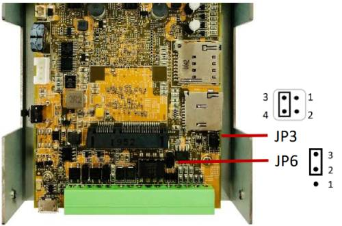
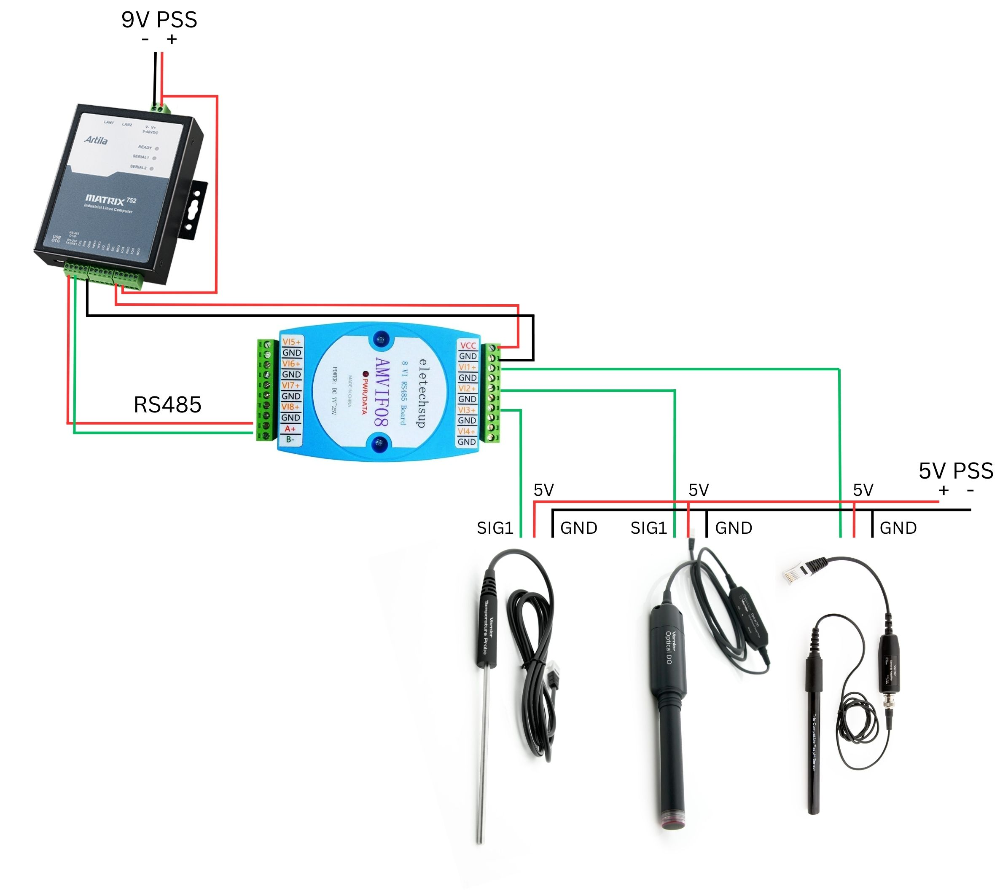

# AquaSenseLinux
*Note: This is a version developed for Artila Matrix752 and/or Matrix518 which are Linux ARM based. For Matrix-310 (Arduino-based) version, please visit the [AquaSense](https://github.com/yurukute/AquaSense/) repository.*

An observing system using Vernier sensors to observe the quality of water in various locations, such as rivers, lakes, and reservoirs. The system will provide real-time data collection, analysis, and reporting capabilities to support environmental monitoring and decision-making processes.
## Feature
- Real-time data collection from water quality sensors, including pH, temperature, dissolved oxygen and decomposition products.
- Measure and manage the changes of water level.
- Integration with external systems or databases for data exchange.
## Getting started
Matrix 752 has one RS-485/RS-323 port which is located on Serial Port 1. Make sure to set it to RS485 both hardware and software.
### Hardware
1. Remove the upper cover of the Matrix-752.
2. Adjust the jumper JP3 and JP6 as below


### Software
Run `setuart` built-in command:
```sh
setuart -p 1 -t 485 -b 9600
```
*Note: The serial port’s mode and associated communication parameters will go back to factory default after system reboot.*
## Interface diagram
