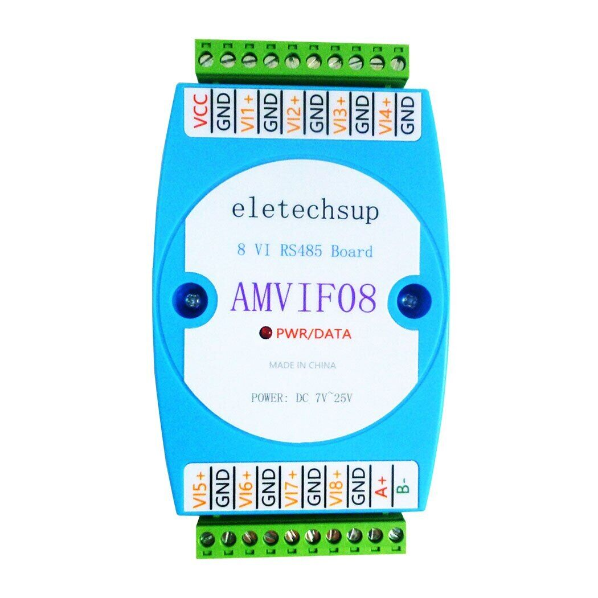

# AMVIF08 manual

## Specifications
- Operating voltage: DC 7-25V (9V 12V 24V).
- Operating Current: 4-20MA.
- Measurement range: 0-10V ± 1%.
- RS485 port isolation protection 3000VDC.

## Modbus RTU frame
A message in AMVIF08 module contains 5 parts:

Send data:
| RS485 addr | Function | Register addr | Read number | CRC16   |
|:----------:|----------|---------------|-------------|---------|
| 1 byte     | 1 byte   | 2 byte        | 2 bytes     | 2 bytes |

AMVIF08 supports 2 commands:
- `03` --- read holding registers
- `04` --- read input registers
- `06` --- write
- `10` --- write multiple

Read command returns data:
| RS485 addr | Function | Data's length | Data    | CRC16   |
|:----------:|----------|---------------|---------|---------|
| 1 byte     | 1 byte   | 1 byte        | n bytes | 2 bytes |

Write command returns data:
| RS485 addr | Function | Register addr | Register value | CRC16   |
|:----------:|----------|---------------|----------------|---------|
| 1 byte     | 1 byte   | 2 byte        | 2 bytes        | 2 bytes |

### Register address
Read-only register:
| Address   | Content             | Unit |
|-----------|---------------------|------|
| 0xA0-0xA7 | CH1-8 voltage value | %V   |

Read/write register:
| Address   | Content                | Read | Write | Unit |
|-----------|------------------------|------|-------|------|
| 0xC0-0xC7 | CH1-8 voltage ratio    |      |       |      |
| 0xF6      | Automatic reporting    |      | 1-255 |      |
| 0xF7      | Product ID             |      |       |      |
| 0xFB      | Factory reset          |      | 0     |      |
| 0xFC      | Command return time    |      | 0-25  | 40ms |
| 0xFD      | RS485 address          | 0xFF | 1-247 |      |
| 0xFE      | Baud rate (9600 8-N-1) |      | 0-255 |      |
| 0xFF      | Parity                 |      | 0-2   |      |

*Baud rate explain: 1200/2400/4800/9600/19200/38400/57600/115200/reset*