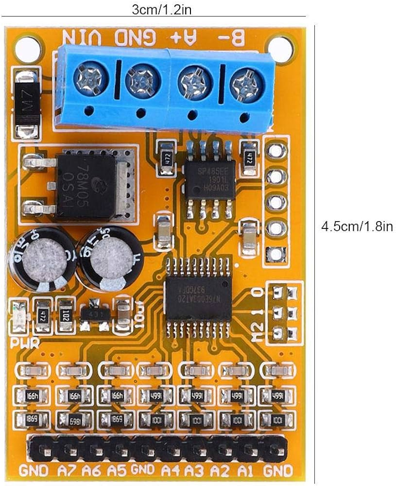

# R4AVA07 manual

## Specifications
- Operating voltage: DC 8-25V.
- Operating Current: 10-15MA.
- Measurement range: 0-5V (CH1-4) or 0-10V (CH5-7) ± 1%.
- Drive current 1MA.
- Slave ID can be set up to 247.

## Modbus RTU frame
A message in R4AVA07 module contains 5 parts:

Send data:
| RS485 addr | Function | Register addr | Read number | CRC16   |
|:----------:|----------|---------------|-------------|---------|
| 1 byte     | 1 byte   | 2 byte        | 2 bytes     | 2 bytes |

R4AVA07 supports 2 commands:
- `03` --- read
- `06` --- write

Read command returns data:
| RS485 addr | Function | Data's length | Data    | CRC16   |
|:----------:|----------|---------------|---------|---------|
| 1 byte     | 1 byte   | 1 byte        | n bytes | 2 bytes |

Write command returns data:
| RS485 addr | Function | Register addr | Register value | CRC16   |
|:----------:|----------|---------------|----------------|---------|
| 1 byte     | 1 byte   | 2 byte        | 2 bytes        | 2 bytes |

### Register address
Read-only register:
| Address   | Content             | Unit |
|-----------|---------------------|------|
| 0x00-0x06 | CH1-7 voltage value | %V   |

Read/write register:
| Address   | Content                | Read | Write | Unit |
|-----------|------------------------|------|-------|------|
| 0x07-0x0D | CH1-7 voltage ratio    |      |       |      |
| 0x0E      | RS485 address          | 0xFF | 1-247 |      |
| 0x0F      | Baud rate (9600 8-N-1) |      | 0-5   |      |

*Baud rate explain: 1200/2400/4800/9600/19200/reset*